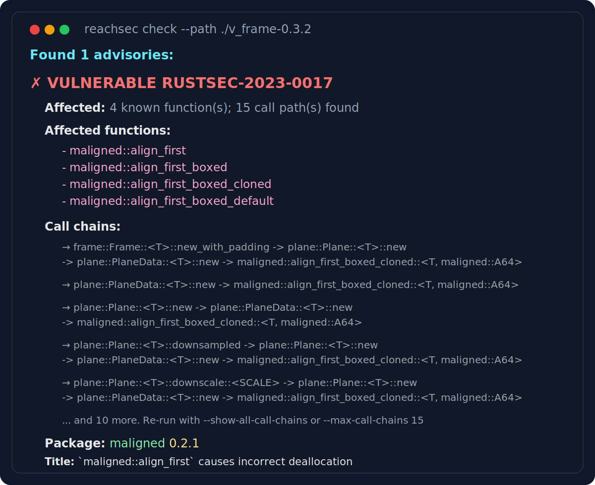

# reachsec

`reachsec` is an experimental standalone companion to `cargo-audit` for local Rust projects.

It starts with the same dependency-based RustSec check, then adds one extra question: can local code reach the affected functions named in the advisory metadata?



Use `cargo audit` for the baseline advisory report. Use `reachsec` when you want the extra analysis that is specific to this project:

- known affected functions from advisory metadata
- whether a call path to those functions can be recovered
- example call chains when the analysis succeeds

`reachsec` is still best-effort analysis, not a replacement for existing tooling. The quality of the result depends on both the advisory metadata and the call graph recovery.

## Quick Install

```bash
curl -sSf https://raw.githubusercontent.com/xizheyin/reachsec/main/install.sh | sh
```

This installs both `reachsec` and `call-cg4rs`.

Requirements:

- `cargo`
- `rustup`
- the nightly toolchain used by `callgraph4rs` will be installed automatically by `install.sh`

## Build from Source

```bash
git clone --recurse-submodules https://github.com/xizheyin/reachsec
cd reachsec
cargo build --release
rustup toolchain install nightly-2025-08-09
rustup component add rustc-dev llvm-tools-preview --toolchain nightly-2025-08-09
cargo +nightly-2025-08-09 install --path callgraph4rs --force
```

`reachsec` itself builds with stable Rust. The nightly toolchain is only required for `callgraph4rs`.

If the repository is already cloned without submodules, run:

```bash
git submodule update --init --recursive
```

## Usage

Check a local Rust project:

```bash
reachsec check --path /path/to/project
```

Check the current directory:

```bash
reachsec check --path .
```

Show all call chains for each advisory:

```bash
reachsec check --path . --show-all-call-chains
```

Increase the per-advisory call-chain display limit:

```bash
reachsec check --path . --max-call-chains 10
```

Output results as JSON:

```bash
reachsec check --path . --json
```

Use a custom working directory for temporary files:

```bash
reachsec check --path . --work-dir /tmp/my-workdir
```

Keep the temporary directory after analysis:

```bash
reachsec check --path . --keep-work-dir
```

## Example

A small end-to-end example uses `v_frame 0.3.2`, which depends on `maligned 0.2.1`.
RustSec records `RUSTSEC-2023-0017` for `maligned`.

```bash
repo_root=$(pwd)
tmpdir=$(mktemp -d /tmp/reachsec-vframe-XXXXXX)
cd "$tmpdir"

curl -A "reachsec/0.1" -fL https://static.crates.io/crates/v_frame/v_frame-0.3.2.crate -o v_frame-0.3.2.crate
tar -xzf v_frame-0.3.2.crate

cd "$repo_root"
reachsec check --path "$tmpdir/v_frame-0.3.2"
```

Example output:

```text
Scanning dependencies in .../v_frame-0.3.2...

Found 1 advisories:

✗ VULNERABLE RUSTSEC-2023-0017
  Affected: 4 known function(s); 15 call path(s) found
  Affected functions:
    - maligned::align_first
    - maligned::align_first_boxed
    - maligned::align_first_boxed_cloned
    - maligned::align_first_boxed_default
  Call chains:
    → frame::Frame::<T>::new_with_padding -> plane::Plane::<T>::new -> plane::PlaneData::<T>::new -> maligned::align_first_boxed_cloned::<T, maligned::A64>
    → plane::PlaneData::<T>::new -> maligned::align_first_boxed_cloned::<T, maligned::A64>
    → plane::Plane::<T>::new -> plane::PlaneData::<T>::new -> maligned::align_first_boxed_cloned::<T, maligned::A64>
    → plane::Plane::<T>::downsampled -> plane::Plane::<T>::new -> plane::PlaneData::<T>::new -> maligned::align_first_boxed_cloned::<T, maligned::A64>
    → plane::Plane::<T>::downscale::<SCALE> -> plane::Plane::<T>::new -> plane::PlaneData::<T>::new -> maligned::align_first_boxed_cloned::<T, maligned::A64>
    ... and 10 more. Re-run with --show-all-call-chains or --max-call-chains 15
  Package: maligned 0.2.1
  Title: `maligned::align_first` causes incorrect deallocation
```

## Output Levels

The `check` command reports four statuses:

- `✗ VULNERABLE`: a call path to an affected function was found
- `⚠ POTENTIALLY VULNERABLE`: affected functions are known, but no call path was found
- `⚠ ANALYSIS FAILED`: affected functions are known, but the analysis tool encountered errors
- `ℹ INFO`: no function-level metadata was available from the advisory

By default, `reachsec` shows up to 5 call chains per advisory. Use `--max-call-chains` or `--show-all-call-chains` when you want more detail.

## Relation to cargo-audit

`reachsec` is intended to complement `cargo-audit`, not replace it.

- `cargo audit` answers whether the resolved dependency graph contains packages affected by RustSec advisories
- `reachsec check` starts from the same dependency graph, then tries to recover call-path evidence to the affected functions

More details about dependency resolution and local project preparation are in [CHECK_WORKFLOW.md](docs/CHECK_WORKFLOW.md).

## Notes

- Run `git submodule update --init --recursive` if `callgraph4rs/` is missing
- Install the call graph tools with `cargo +nightly-2025-08-09 install --path callgraph4rs --force` if `call-cg4rs` is missing
- Reachability analysis can be slow on large projects
- Many RustSec advisories do not include function-level metadata, so some results remain limited or unavailable

## Citation

If you use `reachsec` in academic research or other publications, please cite it as software.

```bibtex
@software{reachsec,
  author = {Yin, Xizhe and Feng, Yang},
  title = {reachsec: RustSec vulnerability checker with function-level reachability analysis},
  url = {https://github.com/xizheyin/reachsec},
  year = {2026}
}
```

## Contributing

The current contribution guide is in [CONTRIBUTING.md](CONTRIBUTING.md).

## License

This repository is available under either [MIT](LICENSE-MIT) or [Apache-2.0](LICENSE-APACHE), at your option.
